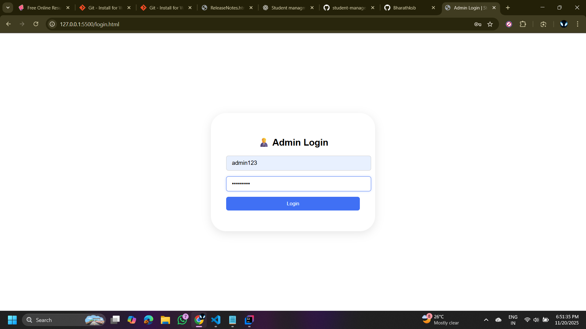
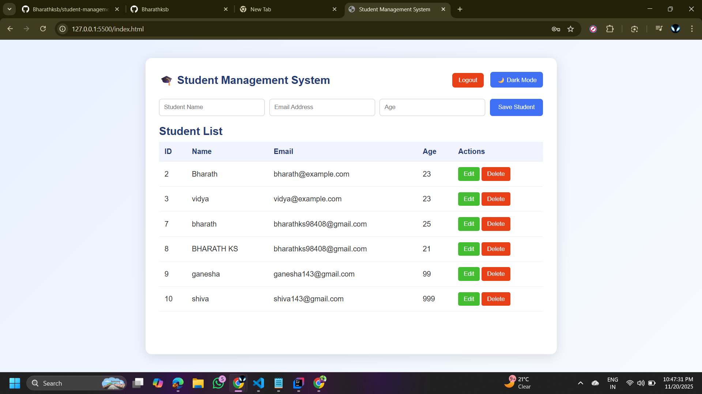
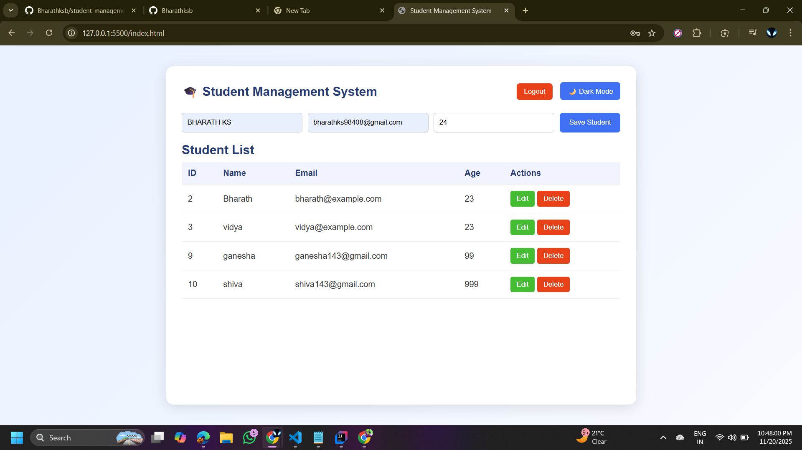
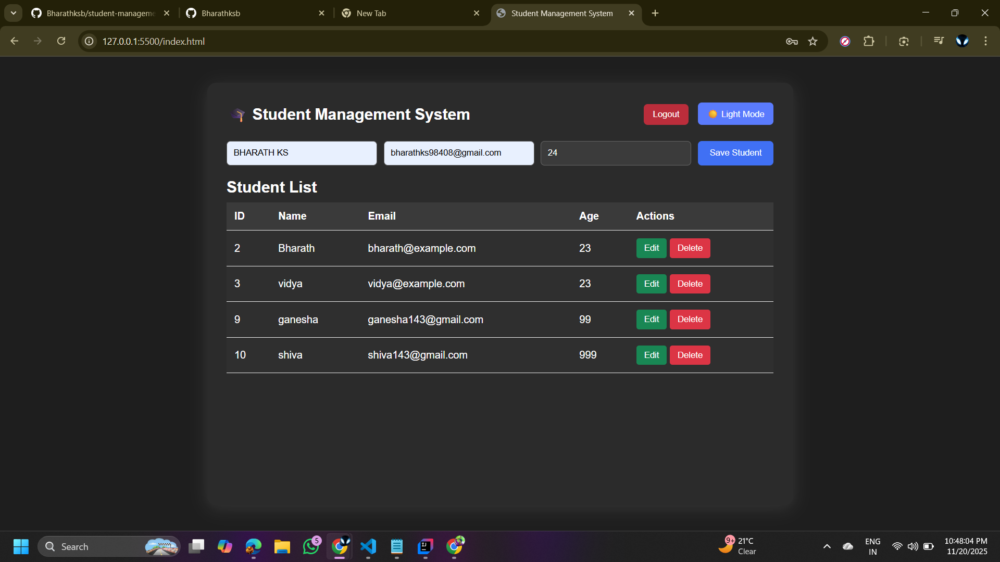

🎓 Student Management System

A full-stack CRUD (Create, Read, Update, Delete) application built using Spring Boot (Backend) + HTML/CSS/JS (Frontend).
This project allows an admin to manage students — add, edit, delete, and view details.

🚀 Features
✅ Frontend

Clean UI with modern styling

Login page

Add Student

Edit Student

Delete Student

View Student List

Dark Mode Toggle

Fully responsive

🔥 Backend (Spring Boot)

REST APIs for CRUD operations

Uses Spring Data JPA

CORS enabled

JSON responses

Connects with MySQL (or H2 if needed)

🔒 Authentication

Simple admin login using browser localStorage

🛠️ Tech Stack
Backend

Java

Spring Boot

Spring Data JPA

Maven

MySQL

Frontend

HTML

CSS

JavaScript

Fetch API

Tools

IntelliJ IDEA / VS Code

Git + GitHub

Postman

🎨 Frontend

Open the folder:
src/main/resources/static/

Open login.html or index.html using Live Server (VS Code).

🖥️ How to Run the Project
🔧 Backend (Spring Boot)

Open project in IntelliJ IDEA or VS Code

Update application.properties:

spring.datasource.url=jdbc:mysql://localhost:3306/studentdb
spring.datasource.username=root
spring.datasource.password=YOUR_PASSWORD
spring.jpa.hibernate.ddl-auto=update

Run the application:
➡️ StudentManagementApplication.java

## 📸 Screenshots

### 🔐 Login Page

### 🏠 Dashboard (Light Mode)

### ➕ Add Student

### 🌙 Dashboard (Dark Mode)

